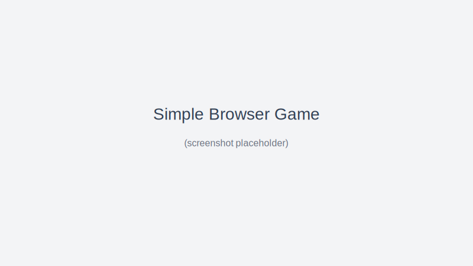

# Simple Browser Game

シンプルなブラウザ向けゲームのテンプレート（Phaser 3 を利用）。

デモ (GitHub Pages): https://hqx8bpcnr5-source.github.io/simple-browser-game-1/

## 概要
- 画面上の円をクリックしてスコアを稼ぐシンプルなゲーム。制限時間内にどれだけ取れるかを競います。

## 使い方（ローカル）
```bash
# リポジトリをクローンして（既に作業中なら不要）
# git clone https://github.com/<your-account>/simple-browser-game-1.git
cd simple-browser-game

# 依存をインストール（Node/npm が必要; eslint/prettier を利用）
npm install

# 開発用サーバーを起動
# python3 の簡易サーバーを使用する例:
python3 -m http.server 8000

# ブラウザで開く: http://localhost:8000/
```

## 開発用スクリプト
- `npm run lint` — ESLint による静的解析を実行
- `npm run format` — Prettier によるコード整形（上書き）

## ファイル構成
- `index.html` — エントリ HTML（Phaser を CDN で読み込み）
- `src/main.js` — ゲームロジック（Phaser シーン、UI 連携）
- `src/style.css` — スタイル

## スクリーンショット


## 貢献
- プルリクエスト歓迎。フォーマットは Prettier、Lint は ESLint に合わせてください。

## ライセンス
このリポジトリは MIT ライセンスの下で公開されています。

---
_注: GitHub Pages は gh-pages ブランチを利用して公開済みです。反映に数分かかる場合があります。_
